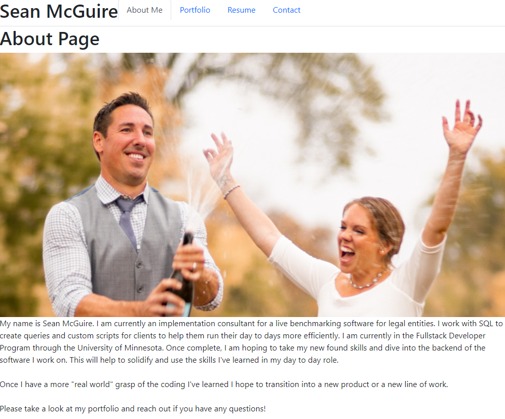

# ReactPortfolio

AS A student who is finishing up an intensive 6 month bootcamp I WANT the ability to market mysel to potential employers with a live webpage portfolio SO THAT I can get a job and pay my bills.

## Description

As someone who has been in the corporate world the last 12+ years, it is beneficial to keep your resume and your list of work up to date.  This updated React Portfolio is a perfect way to display the work/ projects that I have done over the last six months in this bootcamp.

After this class is done I hope to take what I've learned and transition it into a new and improved role where I can implement software while at the same time troubleshoot and make enhancements to the backend as well.  This portfolio will be a step in the right direction to help secure that dream role.

This project is a react app and I am a big fan of react - I hope to use it more in the future.

## Table of Contents (Optional)

If your README is long, add a table of contents to make it easy for users to find what they need.

- [Installation](#installation)
- [Usage](#usage)
- [Credits](#credits)
- [License](#license)

## Installation

No Installation Necessary - simply launch a web browser and navigate to:  https://swmcguire.github.io/ReactPortfolio 

Once there you'll have the ability to learn more about who I am, see my portfolio of work, download my resume and reach out to me via my different platforms.

Enjoy!!

## Usage

Live site:  https://swmcguire.github.io/ReactPortfolio 
GitHub Repo:  https://github.com/swmcguire/ReactPortfolio.git 
GitHub Profile:  https://github.com/swmcguire

No Install necessary - simply launch from the Live Site URL above and see what I can bring to your company.

## Credits

Tutor: Brandon Leek 
Wk 20 Class work 

## License

MIT License

Copyright (c) 2022 swmcguire

Permission is hereby granted, free of charge, to any person obtaining a copy
of this software and associated documentation files (the "Software"), to deal
in the Software without restriction, including without limitation the rights
to use, copy, modify, merge, publish, distribute, sublicense, and/or sell
copies of the Software, and to permit persons to whom the Software is
furnished to do so, subject to the following conditions:

The above copyright notice and this permission notice shall be included in all
copies or substantial portions of the Software.

THE SOFTWARE IS PROVIDED "AS IS", WITHOUT WARRANTY OF ANY KIND, EXPRESS OR
IMPLIED, INCLUDING BUT NOT LIMITED TO THE WARRANTIES OF MERCHANTABILITY,
FITNESS FOR A PARTICULAR PURPOSE AND NONINFRINGEMENT. IN NO EVENT SHALL THE
AUTHORS OR COPYRIGHT HOLDERS BE LIABLE FOR ANY CLAIM, DAMAGES OR OTHER
LIABILITY, WHETHER IN AN ACTION OF CONTRACT, TORT OR OTHERWISE, ARISING FROM,
OUT OF OR IN CONNECTION WITH THE SOFTWARE OR THE USE OR OTHER DEALINGS IN THE
SOFTWARE.

---